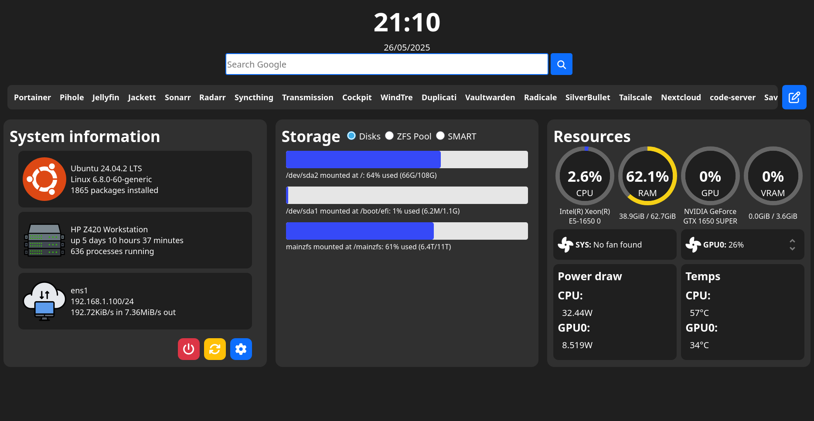

# serverWebUI
A simple dashboard for your Linux server, running on a Flask backend.



This program gathers system information from various monitoring tools and shows it in a simple web interface, together with basic system controls and a bookmark feature, for quick access to your self-hosted services or favorite websites.

## Compatibility
Tested on:
- Debian
- Ubuntu
- Arch
- Fedora

Other distros should work but they might have problems with dependencies.

Both Intel and AMD CPUs are supported, meanwhile only Nvidia GPUs are supported as of now. Support for Intel and AMD in the works.

## Dependencies
Make sure you have the appropriate dependencies for your distribution!

If you plan to install using the auto install script (Ubuntu and Arch only), you may skip the installation of these.

Debian:
```
fastfetch
smartmontools
linux-cpupower
python3-pip
python3-venv
jq
```

Ubuntu:
```
fastfetch
smartmontools
python3-pip
python3-venv
jq
linux-tools-$(uname -r)
```

Arch/Fedora:
```
turbostat (not needed in Fedora)
fastfetch
smartmontools
cpupower
python-pip
jq
```

## Installation
If you're on Ubuntu, Arch or Fedora, an automatic installation script is available, but it is recommended to follow the instructions and install manually.
### Manual installation

Clone the repository:
```
git clone https://github.com/riccardoluongo/serverwebui
cd serverwebui
```

Create the log and database directory:
```
mkdir log
mkdir database
```

Create and activate a python virtual environment:
```
python3 -m venv venv
source venv/bin/activate
```

Install the required packages:
```
pip install -r requirements.txt
```

Make the start.sh script executable:
```
chmod +x start.sh
```

You can now run the program with:
```
sudo ./start.sh -p YOURPORT
```
or create a systemd service to automatically start it at boot:
>* Edit webui.service
>* Replace DIR with the current directory ($PWD)
>* Replace PORT with the port you want to use
>* Replace WORKERS with the number of gunicorn workers you want to use (higher = more performance at the cost of higher memory usage). A good default is (cpu_cores * 2)
>* Copy the file to the systemd services directory:
```
sudo cp webui.service /etc/systemd/system/
```
>* Enable and start the service:
```
sudo systemctl daemon-reload
sudo systemctl enable webui.service
sudo systemctl start webui.service
```

### Automatic installation
Make the install and start scripts executable:
```
sudo chmod +x install.sh
sudo chmod +x start.sh
```

Run the install script:
```
./install.sh
```
During the installation, you will be prompted for the port to use and the number of workers. Once entered, the installation should complete on its own.

The dashboard should now be reachable at the port of choice.
